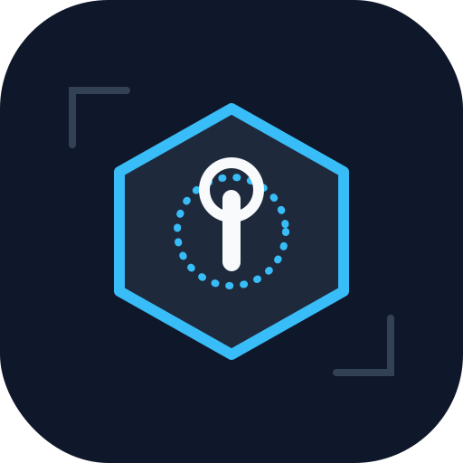
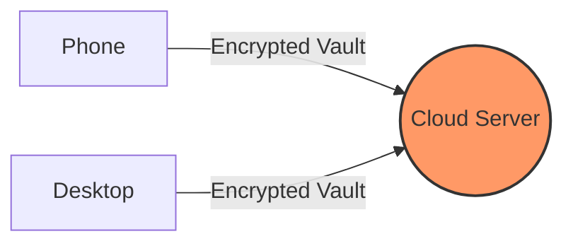
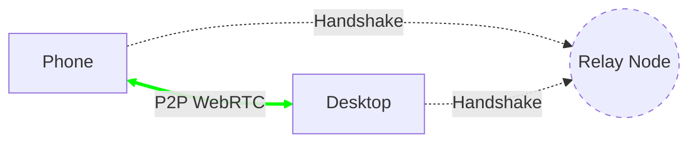
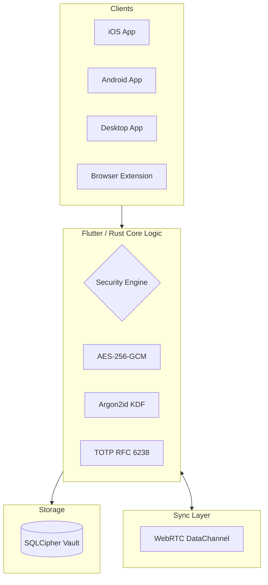
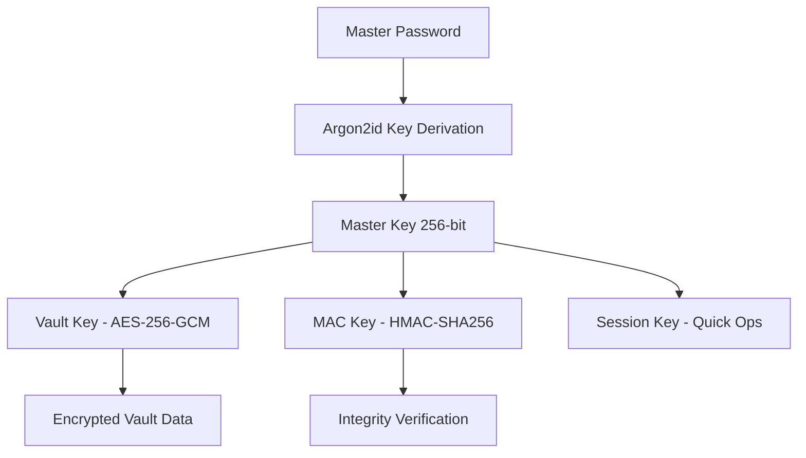

# 🔐 Myki: Remember Everything, Share Nothing.

<p align="center">
  
</p>

<p align="center">
  
  
  
  
  
</p>

<p align="center">
  
  
  
</p>

---

> ### 🔥 Like Myki? Love Myki's Spirit? Meet **Myki** — The Open Source Revival!
>
> Built from the ground up with modern cryptography, Myki brings back the magic of true peer-to-peer password syncing. No cloud. No servers. Just your devices, talking directly to each other with military-grade encryption.

---

## ✨ Why Myki?

Myki is built for those who refuse to trust the cloud with their most sensitive data. Unlike traditional managers, it combines **military-grade security** with **frictionless peer-to-peer syncing**.

- 🔐 **Zero-Knowledge**: Your master password never leaves your brain; your vault never leaves your devices.
- 📡 **P2P Sync**: Direct device-to-device communication via WebRTC. No central server to breach.
- 🛡️ **Modern Crypto**: Powered by **Argon2id** (memory-hard KDF) and **AES-256-GCM** (authenticated encryption).
- 🚀 **Native Performance**: Core logic written in **Rust** for maximum speed and memory safety.
- 🌐 **Open Source**: Auditable, transparent, and community-driven.

---

## 📊 Offline Manager Comparison

How Myki stacks up against the best "local-first" and offline password managers.

| Feature               | Myki (P2P)      | KeePassXC       | Enpass          | Strongbox       |
| --------------------- | --------------- | --------------- | --------------- | --------------- |
| **Primary Storage**   | Local (Secure)  | Local (.kdbx)   | Local / Cloud   | Local / Cloud   |
| **Sync Method**       | **Direct P2P**  | Manual / Plugin | Cloud Relay     | Cloud Relay     |
| **Key Derivation**    | **Argon2id**    | Argon2id        | PBKDF2          | Argon2id        |
| **Modern UI/UX**      | ✅ Yes          | ❌ Legacy       | ✅ Yes          | ✅ Yes (iOS)    |
| **Browser Ext.**      | ✅ Native Rust  | ✅ Yes          | ✅ Yes          | ✅ Yes          |
| **Mobile Biometrics** | ✅ Face/TouchID | ✅ Partial      | ✅ Yes          | ✅ Yes          |
| **Native Core**       | **Rust**        | C++             | C++             | Swift           |
| **Open Source**       | ✅ Yes          | ✅ Yes          | ❌ No           | ✅ Yes (Core)   |

### **The Myki Advantage**
While **KeePassXC** is highly secure, it lacks modern, seamless syncing. **Enpass** offers sync but relies on 3rd-party clouds (Dropbox/Google Drive) which increases your attack surface. **Myki** bridges this gap: the security of a completely offline manager with the convenience of an automated cloud manager.

---

## 🚀 The Myki Difference

### Before (The Cloud Way)
Traditional managers use a central server as a middleman, creating a single point of failure and a high-value target for hackers.



### After (The Myki Way)
Myki devices talk directly to each other. Your data never lives on a server, and the connection is end-to-end encrypted.



---

## 🏗️ Architecture



---

## 🔒 Security Model

### Encryption Stack
Our security model follows the defense-in-depth principle, ensuring your master password is never stored and your vault is robust against brute-force attacks.



### Cracking Time Comparison

| Attacker Hardware | Myki (Argon2id) | Others (PBKDF2) |
| ----------------- | --------------- | --------------- |
| Single RTX 4090   | ~10¹⁵ years     | ~10⁸ years      |
| 1000 GPU Cluster  | ~10¹² years     | ~10⁵ years      |
| Custom ASIC       | Impractical     | ~10³ years      |

---

## 📱 Features

### Core Features

| Feature                 | Status | Description                    |
| ----------------------- | ------ | ------------------------------ |
| 🔐 Master Password      | ✅     | Argon2id key derivation        |
| 👆 Biometric Unlock     | ✅     | Face ID, Touch ID, Fingerprint |
| 📝 Credential Storage   | ✅     | AES-256-GCM encrypted          |
| 🔄 P2P Sync             | ✅     | WebRTC direct connection       |
| ⏱️ TOTP 2FA             | ✅     | RFC 6238 authenticator         |
| 🎲 Password Generator   | ✅     | Customizable complexity        |
| 📋 Clipboard Auto-Clear | ✅     | Configurable timeout           |
| 🔍 Search & Filter      | ✅     | Full-text search               |
| ⭐ Favorites            | ✅     | Quick access items             |
| 📁 Folders              | ✅     | Organize credentials           |

### Platform Support

| Platform | Support | Status |
| :--- | :--- | :--- |
| **Mobile** | iOS, Android | ✅ Done |
| **Desktop** | Windows, macOS, Linux | ✅ Done |
| **Extensions** | Chrome, Firefox, Edge, Safari | ✅ Done |

---

## 🛠️ Tech Stack

| Layer           | Technology             | Why                                |
| --------------- | ---------------------- | ---------------------------------- |
| **Mobile UI**   | Flutter                | Cross-platform, native performance |
| **Desktop UI**  | Tauri + HTML/CSS       | Lightweight, native feel           |
| **Core Crypto** | Rust                   | Memory-safe, high performance      |
| **Encryption**  | AES-256-GCM + Argon2id | Industry standard                  |
| **Database**    | SQLCipher              | Encrypted SQLite                   |
| **Sync**        | WebRTC                 | P2P encrypted channels             |
| **State**       | BLoC Pattern           | Predictable, testable              |

---

## 🚀 Quick Start

### Flutter Mobile App

```bash
# Clone the repository
git clone https://github.com/rahulmasal/MyKi.git
cd MyKi/myki_app

# Install dependencies
flutter pub get

# Run on iOS
flutter run -d "iPhone 14 Pro"

# Run on Android
flutter run -d "Pixel 6"
```

### Desktop App (Windows/macOS/Linux)

```bash
cd MyKi/myki_extension/src-tauri

# Install Rust dependencies
cargo fetch

# Development mode
cargo tauri dev

# Production build
cargo tauri build
```

---

## 📂 Project Structure

```text
myki/
├── 📄 README.md                      # This file
├── 📄 TECHNICAL_SPECIFICATION.md     # Detailed architecture docs
├── 📄 SECURITY_COMPARISON.md         # Security vs competitors
├── 📱 myki_app/                      # Flutter Mobile App
├── 🦀 myki_core/                     # Shared Rust Core
└── 🖥️ myki_extension/                # Tauri Desktop App & Web-Ext
```

---

## 🗺️ Roadmap

```text
Phase 1 ✅ Core Vault
Phase 2 ✅ Biometric Auth
Phase 3 ✅ TOTP 2FA
Phase 4 ✅ P2P Sync
Phase 5 ✅ Browser Extension
Phase 6 ✅ Desktop App
Phase 7 ✅ Emergency Access
Phase 8 ✅ Secure Attachments
```

---

## 🤝 Contributing

We welcome contributions! Here's how you can help:

### 🌟 Areas Needing Help
- 🧪 **Security Penetration Testing**: We need experts to try and break the P2P sync and vault encryption.
- 🔧 **Rust Crypto Audit**: Professional review of our `myki_core` implementation.
- 🎨 **Mobile UI/UX Refinement**: Making the Flutter app feel even more "native" and fluid.
- 🚀 **Performance Optimization**: Tuning WebRTC throughput for large vault transfers.

```bash
# 1. Fork the repository
# 2. Create your feature branch
git checkout -b feature/amazing-feature

# 3. Commit your changes
git commit -m "Add amazing feature"

# 4. Push to the branch
git push origin feature/amazing-feature

# 5. Open a Pull Request
```

---

## 📜 License

MIT License - Use it freely, but keep the credits.

---

## 🙏 Acknowledgments

<div align="center">

**Inspired by the legendary [Myki](https://myki.com/)** — the original P2P password manager that showed the world how it should be done.

Built with ❤️ and a lot of ☕ by the open source community.

</div>

---

## 🔗 Links

- 📘 [Technical Specification](TECHNICAL_SPECIFICATION.md)
- 🛡️ [Security Comparison](SECURITY_COMPARISON.md)
- 💬 [Discord Community](https://discord.gg/myki)
- 🐛 [Issue Tracker](https://github.com/rahulmasal/MyKi/issues)

---

<p align="center">
  <strong>🔐 Your secrets. Your devices. Your keys.</strong>
  <br>
  <sub>Myki: Remember Everything, Share Nothing.</sub>
  <br>
  <sub>Made with ❤️ for the open source community</sub>
</p>
