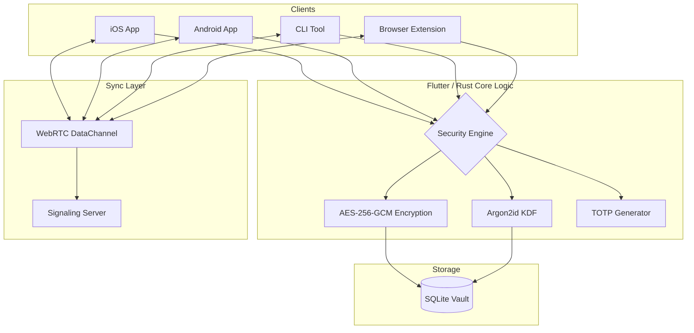
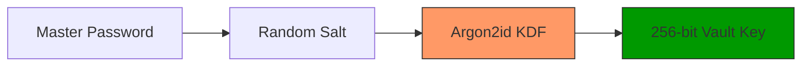
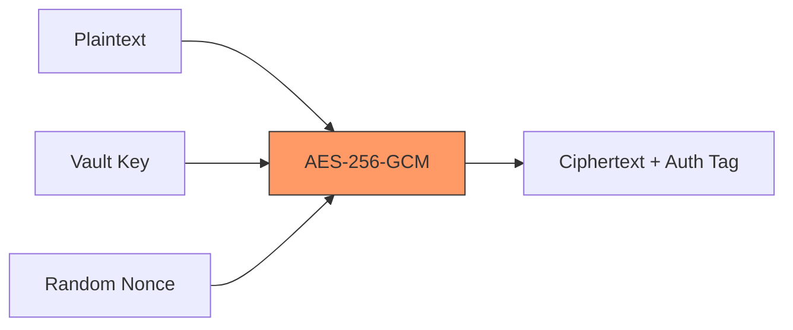
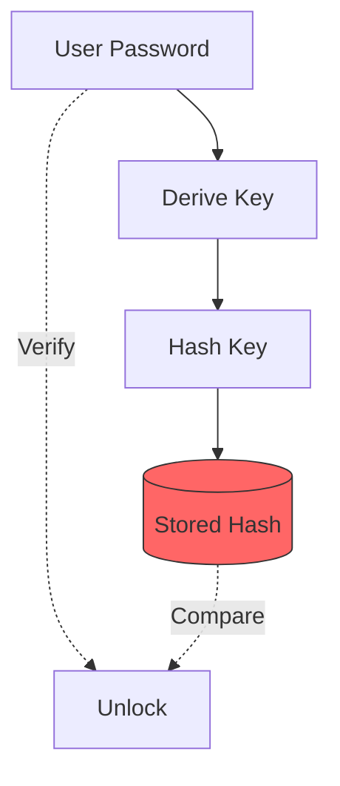

# Myki - P2P Password Manager

<p align="center">
  
</p>

<p align="center">
  <strong>A secure, local-first password manager with peer-to-peer sync</strong>
</p>

---

## 📖 Table of Contents

- [Overview](#overview)
- [Architecture](#architecture)
- [Projects](#projects)
- [Security Model](#security-model)
- [Downloads](#downloads)
- [Getting Started](#getting-started)
  - [Windows](#-windows)
  - [macOS](#-macos)
  - [Ubuntu / Linux](#-ubuntu--linux)
  - [iOS (iPhone)](#-ios-iphone)
  - [Android](#-android)
- [Contributing](#contributing)

---

## 🌍 Overview

**Myki** is an open-source password manager designed with security and privacy as its core principles. Unlike cloud-based password managers, Myki stores all data locally on your device, giving you complete control over your sensitive information.

### Key Features

- **🔐 Local-First Security**: All encryption happens on-device. Your master password never leaves your device.
- **🧬 Cryptographic Best Practices**: Uses Argon2id for key derivation and AES-256-GCM for encryption.
- **⏱️ Two-Factor Authentication (TOTP)**: Built-in support for time-based one-time passwords.
- **📱 Cross-Platform**: Flutter for mobile (iOS/Android), Rust for core logic, Tauri for extensions.
- **🔄 Peer-to-Peer Sync**: WebRTC-based sync without centralized servers.

---

## 🏗️ Architecture

### High-Level Overview



### Data Flow

1. **User authenticates** with master password
2. **Argon2id KDF** derives a 256-bit vault key from password + salt
3. **Vault key** encrypts/decrypts all credential data using AES-256-GCM
4. **TOTP secrets** generate time-based codes for 2FA
5. **Encrypted database** stores all data securely on disk

---

## 📁 Projects

### [`myki_core/`](myki_core/) - Rust Core Library

The cryptographic engine powering Myki. Written in Rust for memory safety and performance.

| Module                             | Purpose                                           |
| ---------------------------------- | ------------------------------------------------- |
| [`crypto/`](myki_core/src/crypto/) | Encryption, key derivation, random generation     |
| [`totp/`](myki_core/src/totp/)     | RFC 6238 TOTP code generation                     |
| [`vault/`](myki_core/src/vault/)   | Encrypted SQLite storage                          |
| [`ffi.rs`](myki_core/src/ffi.rs)   | Foreign Function Interface for non-Rust consumers |

### [`myki_app/`](myki_app/) - Flutter Mobile App

Cross-platform mobile application (iOS & Android).

| Directory                                                         | Purpose                                               |
| ----------------------------------------------------------------- | ----------------------------------------------------- |
| [`lib/core/models/`](myki_app/lib/core/models/)                   | Data structures (Credential, Identity, etc.)          |
| [`lib/core/services/`](myki_app/lib/core/services/)               | Business logic (VaultService, BiometricService, etc.) |
| [`lib/presentation/blocs/`](myki_app/lib/presentation/blocs/)     | State management (AuthBloc, VaultBloc)                |
| [`lib/presentation/pages/`](myki_app/lib/presentation/pages/)     | Screen UI (UnlockPage, VaultPage, etc.)               |
| [`lib/presentation/widgets/`](myki_app/lib/presentation/widgets/) | Reusable UI components                                |

#### Mobile App Features

- **🔐 Secure Unlock**: Master password and biometric authentication (fingerprint/face)
- **📋 Credential Management**: Add, view, edit, delete credentials with TOTP support
- **⭐ Favorites**: Mark frequently used credentials as favorites for quick access
- **🔍 Smart Search**: Search credentials by title, username, or URL
- **📱 Persistent Storage**: SQLite database with AES-GCM encryption for sensitive data
- **⏱️ Live TOTP**: Real-time two-factor authentication codes with countdown timer
- **📋 Clipboard Security**: Auto-clear sensitive data from clipboard after 30 seconds
- **🛡️ Security Features**: Jailbreak detection, screenshot protection, app switcher blur

### [`myki_cli/`](myki_cli/) - Command Line Interface

Terminal-based interface for power users.

```bash
myki_cli list                    # List all credentials
myki_cli search "github"          # Search credentials
myki_cli add "GitHub" "user@..." # Add new credential
```

### [`myki_extension/`](myki_extension/) - Desktop App & Browser Extension

Tauri-based desktop application and browser extension.

**Desktop App** (`myki_extension/src-tauri/`) — Full-featured vault management:
- Create/unlock/lock encrypted vaults
- Add, search, delete credentials
- Built-in password generator
- System tray integration
- On-demand password fetching (passwords never loaded eagerly)
- Clipboard auto-clear after 30 seconds

**Browser Extension** (`myki_extension/web-extension/`) — Read-only credential access:
- View and search credentials
- Copy passwords on demand via native messaging
- Connects to the desktop app's vault

### [`myki_native_host/`](myki_native_host/) - Native Messaging Host

Bridge between the browser extension and the local vault. Implements the Chrome Native Messaging protocol to relay commands (unlock, list, search, get_password) to the encrypted SQLite vault.

### [`myki_signaling_server/`](myki_signaling_server/) - WebRTC Signaling Server

WebSocket-based relay for WebRTC peer discovery. Helps Myki devices find each other and exchange signaling messages (SDP offers/answers, ICE candidates) for peer-to-peer sync. Actual sync data flows directly between devices over WebRTC — never through the signaling server.

---

## 🔒 Security Model

### Key Derivation (Argon2id)



**Why Argon2id?**

- Memory-hard: Resistant to GPU/ASIC attacks
- Side-channel resistant: Safe against timing attacks
- Industry standard: Winner of Password Hashing Competition

### Encryption (AES-256-GCM)



**Why GCM?**

- Authenticated Encryption: Confidentiality + Integrity
- Random nonce: Each encryption is unique
- Hardware accelerated: Fast on modern CPUs

### Password Storage



**Important**: The master password is NEVER stored. Only a hash of the derived key is stored for verification.

### Vault Integrity Verification

On creation, the vault stores an encrypted canary value. On every unlock, the canary is decrypted and verified to ensure the correct password was provided. Wrong passwords are rejected immediately with a clear error message.

### On-Demand Password Fetching

Passwords are never eagerly loaded into memory. List and search operations return only metadata (id, title, username, url). The actual password is fetched only when the user explicitly requests it (e.g., clicking "copy").

### Memory Security

- **Zeroize on Drop**: `Credential` structs automatically zero sensitive fields (password, notes) when dropped
- **Argon2id with 128 MiB**: Memory-hard key derivation resists GPU/ASIC attacks
- **Key Zeroization**: `VaultKey` and `MacKey` are zeroed on drop via the `zeroize` crate

### Clipboard Security

Both the desktop app and browser extension auto-clear the clipboard 30 seconds after copying a password.

---

## 📦 Downloads

> **Automatic Builds**: All platforms are automatically built and released when a version tag is pushed (`git tag v* && git push`).

### Desktop Apps

| Platform   | File Type               | Download                                                       |
| ---------- | ----------------------- | -------------------------------------------------------------- |
| 🪟 Windows | `.exe` (NSIS installer) | [GitHub Releases](https://github.com/rahulmasal/MyKi/releases) |
| 🪟 Windows | `.msi` (MSI installer)  | [GitHub Releases](https://github.com/rahulmasal/MyKi/releases) |
| 🍎 macOS   | `.dmg` (Disk Image)     | [GitHub Releases](https://github.com/rahulmasal/MyKi/releases) |
| 🐧 Linux   | `.deb` (Debian/Ubuntu)  | [GitHub Releases](https://github.com/rahulmasal/MyKi/releases) |
| 🐧 Linux   | `.AppImage` (Universal) | [GitHub Releases](https://github.com/rahulmasal/MyKi/releases) |

### Mobile Apps

| Platform   | File Type      | Download                                                       |
| ---------- | -------------- | -------------------------------------------------------------- |
| 📱 Android | `.apk`         | [GitHub Releases](https://github.com/rahulmasal/MyKi/releases) |
| 📱 iOS     | `.app` (Xcode) | [GitHub Releases](https://github.com/rahulmasal/MyKi/releases) |

### Browser Extensions

| Browser    | File Type | Download                                                       |
| ---------- | --------- | -------------------------------------------------------------- |
| 🌐 Chrome  | `.zip`    | [GitHub Releases](https://github.com/rahulmasal/MyKi/releases) |
| 🦊 Firefox | `.zip`    | [GitHub Releases](https://github.com/rahulmasal/MyKi/releases) |

### CLI Tool

Build from source using Rust:

```bash
cargo install --git https://github.com/rahulmasal/MyKi.git myki_cli
```

---

## 🚀 Getting Started

### Prerequisites

- **Rust** 1.70+ (for building core)
- **Flutter** 3.10+ (for mobile app)
- **Android SDK** / **Xcode** (for mobile development)

---

### 🪟 Windows

#### CLI Tool

```powershell
# Install via cargo (requires Rust)
cargo install --git https://github.com/your-org/myki.git myki_cli

# Or build from source
git clone https://github.com/your-org/myki.git
cd myki/myki_cli
cargo build --release
# Executable at: target/release/myki_cli.exe
```

#### Browser Extension

1. Install [Rust](https://rustup.rs/)
2. Install [Visual Studio Build Tools](https://visualstudio.microsoft.com/visual-cpp-build-tools/)
3. Clone and build:

```powershell
git clone https://github.com/your-org/myki.git
cd myki/myki_extension
cargo build --release
```

#### Mobile App (Android)

1. Install [Flutter SDK](https://docs.flutter.dev/get-started/install/windows)
2. Install [Android Studio](https://developer.android.com/studio)
3. Build:

```powershell
cd myki/myki_app
flutter build apk --release
```

---

### 🍎 macOS

#### CLI Tool

```bash
# Install via cargo (requires Rust)
cargo install --git https://github.com/your-org/myki.git myki_cli

# Or build from source
git clone https://github.com/your-org/myki.git
cd myki/myki_cli
cargo build --release
# Executable at: target/release/myki_cli
```

#### Browser Extension

1. Install Rust: `curl --proto '=https' --tlsv1.2 -sSf https://sh.rustup.rs | sh`
2. Clone and build:

```bash
git clone https://github.com/your-org/myki.git
cd myki/myki_extension
cargo build --release
```

#### Mobile App (iOS)

1. Install Flutter: `brew install flutter`
2. Install Xcode from Mac App Store
3. Build:

```bash
cd myki/myki_app
flutter build ios --release
```

> **Note**: iOS builds require a Mac with Xcode.

---

### 🐧 Ubuntu / Linux

#### CLI Tool

```bash
# Install Rust
curl --proto '=https' --tlsv1.2 -sSf https://sh.rustup.rs | sh
source ~/.cargo/env

# Install via cargo
cargo install --git https://github.com/your-org/myki.git myki_cli

# Or build from source
git clone https://github.com/your-org/myki.git
cd myki/myki_cli
cargo build --release
# Executable at: target/release/myki_cli
```

#### Browser Extension

1. Install dependencies:

```bash
sudo apt update
sudo apt install -y libwebkit2gtk-4.1-dev libappindicator3-dev librsvg2-dev patchelf
```

2. Clone and build:

```bash
git clone https://github.com/your-org/myki.git
cd myki/myki_extension
cargo build --release
```

#### Mobile App (Android)

```bash
# Install Flutter
sudo snap install flutter --classic

# Install Android SDK
sudo apt install -y android-sdk

# Build
cd myki/myki_app
flutter build apk --release
```

---

### 📱 iOS (iPhone)

The Myki mobile app supports iOS devices.

#### Requirements

- Mac with Xcode 14+
- Flutter 3.10+
- Apple Developer Account (for device deployment)

#### Building

```bash
cd myki/myki_app

# List available simulators
xcrun simctl list devices available

# Run on simulator
flutter run -d <simulator-id>

# Build for App Store
flutter build ipa --release
```

#### Installation on iPhone

1. Open the `.ipa` file in Xcode
2. Select your device as target
3. Click "Run" or use "Product > Archive" for distribution

> **Note**: Requires Apple Developer Program membership for testing on physical devices.

---

### 📱 Android

Pre-built APK available in [`releases/`](releases/myki-android.apk)

For manual installation on Android:

1. Enable "Install from unknown sources" in Settings > Security
2. Download the APK from releases
3. Open and install

---

### Building

```bash
# Clone the repository
git clone https://github.com/your-org/myki.git
cd myki

# Build Rust core
cd myki_core
cargo build --release

# Build Flutter app
cd ../myki_app
flutter pub get
flutter run

# Build CLI
cd ../myki_cli
cargo build --release
```

### Running Tests

```bash
# Rust tests
cd myki_core
cargo test

# Flutter tests
cd ../myki_app
flutter test
```

---

## 👨‍💻 Contributing

1. **Fork** the repository
2. **Create a feature branch** (`git checkout -b feature/amazing-feature`)
3. **Commit your changes** (`git commit -m 'Add amazing feature'`)
4. **Push to the branch** (`git push origin feature/amazing-feature`)
5. **Open a Pull Request**

---

## 📄 License

This project is licensed under the MIT License - see the LICENSE file for details.

---

## 🙏 Acknowledgments

- **Argon2**: For the excellent password hashing algorithm
- **Flutter**: For the cross-platform UI framework
- **Rust**: For the safe and fast core library
- **SQLite**: For the reliable embedded database
